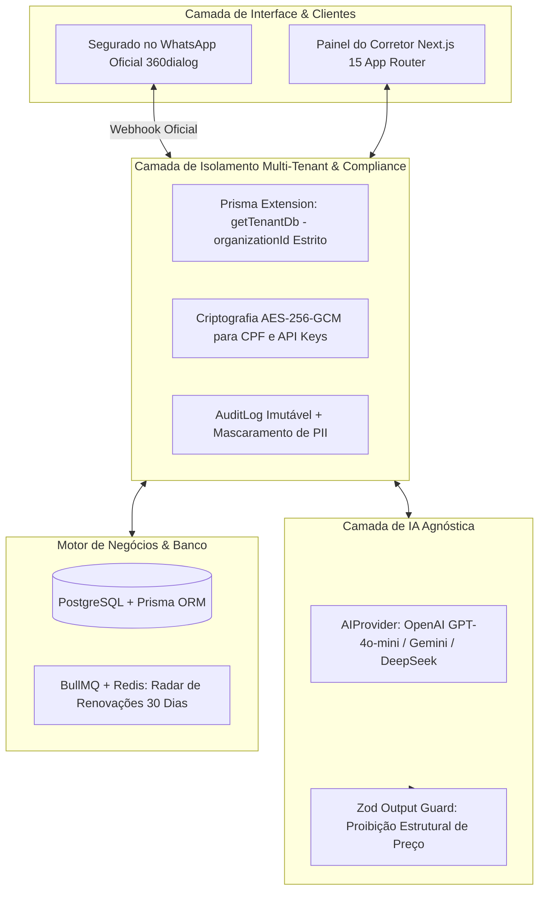

# insurance-ai — Plataforma de Gestão e Atendimento WhatsApp para Corretores de Seguros

Uma plataforma SaaS moderna, corporativa e estritamente **multi-tenant**, desenvolvida para corretores de seguros e corretoras (PME a Enterprise). O sistema orquestra o atendimento de potenciais segurados e segurados ativos via **WhatsApp Oficial (360dialog / Meta Cloud API)**, acelerando a qualificação de leads e automatizando o **radar de renovações (janela de 30 dias)**, com **isolamento absoluto entre corretoras** e **restrições estruturais de compliance da SUSEP**.

---

## 🛑 Decisões de Produto Críticas e Não-Negociáveis

Este sistema opera em um mercado financeiro e securitário regulado pela **SUSEP (Superintendência de Seguros Privados)**, no qual erros de preço, promessas irreais de cobertura ou vazamento de dados geram graves riscos regulatórios e cíveis. Por essa razão, duas regras pétreas foram implementadas no código como restrições estruturais:

### 1. A IA NUNCA GERA, CALCULA OU SUGERE PREÇO
> **Isso não é uma mera instrução de prompt — é uma barreira de arquitetura.**
> 
> * **Schema Zod sem campos monetários:** O schema de saída da IA (`LeadQualificationOutputSchema`) **não possui nenhum campo** do tipo `valor`, `preço`, `prêmio` ou `franquia`. A IA fisicamente não tem como preencher esses dados porque os atributos não existem no schema tipado.
> * **Validador de Violação de Preço (`validateAiOutputWithoutPrice`):** Caso um modelo tente alucinar e injetar termos como `R$ 1.500`, `prêmio: 2000` ou `franquia: 500` no texto livre, o sistema intercepta imediatamente e lança um `PriceGenerationForbiddenError`, bloqueando o salvamento.
> * **Cotações Humanas Exclusivas:** No banco de dados, todo registro de cotação (`Cotacao`) possui `criadoPorId` vinculado obrigatoriamente a um corretor humano autenticado (`User`). O valor do prêmio só entra no sistema quando o corretor digita na tela de Cotações.

### 2. REVISÃO HUMANA OBRIGATÓRIA (NENHUM ENVIO 100% AUTÔNOMO)
> **Nenhuma mensagem gerada pela IA é disparada diretamente para o WhatsApp do segurado.**
> 
> * Todas as minutas geradas pela IA nascem com `review_status = 'pending_review'` e `requires_review = true`.
> * Na interface do corretor, a mensagem aparece visualmente destacada como **Rascunho de IA**.
> * O envio oficial pela API da 360dialog **só ocorre** após o clique explícito do corretor em **"Aprovar e Enviar"** ou após a edição manual do texto.

---

## 🏗️ Arquitetura do Sistema



---

## 🏛️ Modelo de Dados de Seguros (Prisma Schema)

O banco de dados foi modelado para contemplar o ecossistema completo de uma corretora:

1. **`Organization`**: A corretora de seguros (tenant). Todos os registros são vinculados a uma organização.
2. **`User` & `Member`**: Corretores e colaboradores da agência com registro na SUSEP.
3. **`Cliente`**: O segurado. O campo `cpfEncrypted` armazena o CPF sob criptografia simétrica forte (**AES-256-GCM**), nunca em texto puro.
4. **`Apolice`**: Registro da apólice com seguradora parceira (Porto Seguro, Bradesco, Allianz, etc.), tipo de cobertura, número da apólice, prêmio e **`dataVencimento`** (chave do motor de renovações).
5. **`Cotacao`**: Proposta formal criada exclusivamente por corretores humanos (`criadoPorId` não nulo).
6. **`Sinistro`**: Controle de sinistros abertos com histórico de atendimentos e responsável.
7. **`Conversation` & `Message`**: Histórico completo de mensagens com controle de `reviewStatus` (`pending_review`, `approved`, `edited`, `rejected`).
8. **`WhatsappConnection`**: Credenciais de conexão da 360dialog salvas com `apiKeyEncrypted`.
9. **`AuditLog`**: Registro auditável de todas as ações de criação, alteração ou exclusão de apólices e cotações.

---

## 🧪 Comprovação dos Testes Automatizados (Fase 1)

A suíte de testes do `insurance-ai` foi executada utilizando **PGlite** (instância real do PostgreSQL 16 compilada em WebAssembly em memória) e **Vitest**, comprovando as regras de segurança antes de qualquer avanço:

```bash
> insurance-ai@0.1.0 test
> vitest run

 ✓ tests/unit/crypto.test.ts (4 tests) 10ms
   ✓ deve criptografar e descriptografar o CPF do segurado com sucesso via AES-256-GCM
   ✓ deve criptografar e descriptografar chaves de API da 360dialog
   ✓ deve mascarar CPF para logs preservando apenas dígitos centrais
   ✓ deve mascarar telefone para logs de auditoria

 ✓ tests/unit/ai-price-restriction.test.ts (4 tests) 36ms
   ✓ o schema de qualificação NÃO deve conter campos de preço, prêmio ou franquia
   ✓ deve exigir obrigatoriamente que requires_review seja true
   ✓ deve lançar PriceGenerationForbiddenError se a IA tentar injetar valores monetários no texto
   ✓ deve gerar minuta de renovação com requiresReview = true via MockAIProvider

 ✓ tests/integration/tenant-isolation.test.ts (4 tests) 1882ms
   ✓ deve bloquear instanciação de tenantDb com organizationId vazio ou inválido
   ✓ deve isolar completamente Clientes criados pela Corretora A impedindo leitura e busca pela Corretora B
   ✓ deve isolar Apólices e impedir que a Corretora B altere ou exclua apólices da Corretora A
   ✓ deve isolar Cotações criadas manualmente por corretores humanos

 Test Files  3 passed (3)
      Tests  12 passed (12)
```

---

## ⚖️ Separação de Responsabilidade (LGPD & SUSEP)

Este aviso técnico serve de subsídio para a elaboração dos Termos de Uso e Política de Privacidade da plataforma:

1. **Operador da Plataforma (Software Provider)**:
   * Fornece a infraestrutura técnica, os mecanismos criptográficos (AES-256-GCM), a camada de integração com a API oficial do WhatsApp e o isolamento lógico das organizações.
   * Não atua como corretor, não define taxas, não emite apólices e não acessa dados descriptografados de segurados fora de rotinas estritas de suporte sob demanda do cliente.
2. **Corretor / Corretora de Seguros (Controlador dos Dados)**:
   * É a entidade legalmente habilitada pela SUSEP para intermediar contratos de seguros.
   * Atua como **Controlador dos Dados Pessoais** perante a LGPD, sendo o único responsável por coletar o consentimento dos segurados para contato via WhatsApp, revisar as minutas antes do envio e registrar valores fidedignos nas cotações.
